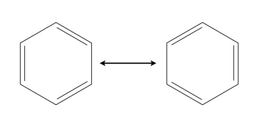
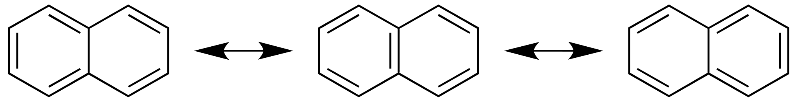
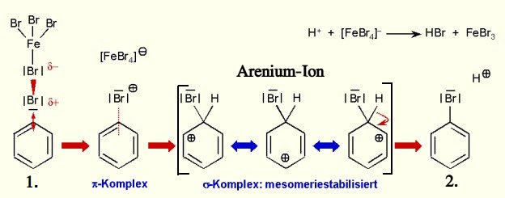

> Die ringe werden **im Uhrzeigersinn** von dem Index 1 numeriert. 

# Polyaddition von Benzol

Wenn man Brom mit [Alkenen](https://en.wikipedia.org/wiki/Alkene) *(funktionelle Gruppe doppelbindung zwischen Kohlenstoffatome)* reagieren lässt, kann man eine Additione beobachten. Die Doppelbindung lößt sich auch, und bindet das Brom. 

Wenn man mit Katalysatoren Benzohl mit Brohm reagiert, findet jedoch keine Addition statt.

Das liegt daran, da die Elektronen der Doppelbindungen **delokalisiert** sind. Das heißt sie sind überall und nirgendswo gleichzeitig, und mann kann nicht sagen wo sie sind. 

Z.B. Ethen hat eine **lokalisierte** Doppelbindung, bei der man weiß wo sie ist. Also passiert bei Ethen eine Addition.

> Benzol ist [mesomerie](#mesomerie)stabilisiert

# Mesomerie

Da man bei *z.B. Benzol* nicht wissen kann, wo die Elektronen sind, weiß man auch nicht wo die Doppelbindungen sind.

Sie sind an verschiedenen Stellen gleichzeitig. Dies nennt man **Mesomerie**. Wichtig ist, das Mesomerie nicht nur bei **Aromaten** existiert.

## Zeichne die Mesomerie von <>

Ist die Aufgabe die Mesomerie von etwas zu zeichnen, zeichnet man alle möglichen Doppelbindungen und dazwischen ein Mesomerie-Pfeil:

$$\leftrightarrow$$

Bei Benzol sieht das beispielsweise so aus:

## Mesomerieenergie

Die Einzelnen Grenzstrukturen haben immer eine höhere Energie als der tatsächliche
Energiezustand des mesomeren Zustandes.  
Dies liegt daran das der mesomere Zusand stabiler als die Grenzstruktren ist.

Die **Mesomerieenergie** bezeichnet die Energiedifferenz zwischen Grenzstruktur und Mesomeres Molkühl. $[\frac{J}{mol}]$

## Orbitalmodell

Ein Molekühl hat für jedes Elektron ein Orbital, in dem sich das Elektron aufhalten kann.

Es existieren $S$-Orbitale, $P$-Orbiale.

Diese können durch eine **hybridisierung** verschmolzen werden, so dass das das Molekühl einen Energetischen besseren Zustand erreicht.

### Beispiel eines Hybridorbitales

$sp^2$ Hybridorbital: Es besteht aus einem $s$-Orbital und $2$ $p$-Orbitalen. 

# Hückel Regel

Unter $\pi$ Elektronene versteht man **delokalisierte Elektronen**.

[Wiki](https://de.wikipedia.org/wiki/H%C3%BCckel-Regel)

Mit Hilfe der Hückel Regel, kann man bestimmen, ob ein Molekül ein Aromat ist.

$$4n + 2 \qquad n \in \mathbb{N}_0$$

 1. Man zählt die $\pi$ Elektronen *(bp. Benzohl: $6$)*
 2. Man setzt gleich und schaut ob es eine Lößung gibt

$$4 n + 2 = 6 \qquad 4n = 4 \qquad n = 1\\ n=1 \in \mathbb{N}_0$$

Wenn das gelößte $n$ zu den natürlichen Zahlen, oder 0 gehört, dann ist das Molekühl ein Aromat. 

> Die Hückel Regel formuliert mathematisch, dass die Anzal der delokalisierten Elektronenpaare ungerade sein mussen um Aromaten zu sein.

## Zählen der $\pi$ Elektronen

- Eine Einfachbindung enthält keine $\pi$ Elektronen
- Eine Doppelbindun enthält $2$ $\pi$ Elektronen
- Eine Dreifachbindung enthält $4$ $\pi$ Elektronen

# Mesomere Grenzstruckturen

**Grenzformeln** sind mehrere Strukturformeln des gleichen Molekühls, die mit einem Mesomeriepfeil abgegrenzt sind.

 1. Alle Grenzformeln müssen in der Anordnung der Atomrümpfe und in der Summe der Valenzelektronen übereinstimmen. In der Anordnung der Valenzelektronen (und damit der Bindungen) unterscheiden sie sich.
 2. Die Summe der Formalladungen muss die Ionenladung erhalten.
 3. Grenzformeln ohne Ladungstrennung sind energetisch günstiger als Grenzformeln mit Ladungstrennung. 
 4. Grenzformeln, in denen alle Atome ein Elektronenoktett haben, sind günstiger als Grenzformen, in denen dies nicht gegeben ist.

# Halogenierung von Benzol

$$C_6H_6 + Br_2 \overset{FeBr_3}{\longrightarrow} C_6H_5Br + HBr_{(g)}$$

Die Halogenisierung von Benzohl ist eine Substitutionsreaktion, bei der ein $H$-Atom des Benzohls mit einem anderen Atom oder Atomgruppe ersetzt wird. *(das delokalisierte Elektron bleibt bestehen.)* 

## Reaktionsmechanismus 

> Reaktionsmechanismus der elektrophilen aromatischen Substitution

1. Elektrophiler Angriff und [heterolytische Spaltung](#heterolytische-spaltung)
2. [Deprotonierung](#deprotonierung) und Rearomatisierung

> $HBr$ ist ein saures Gas, und ist verantwortlich, das sich der Indikator von blau zu gelb gefärbt wurde.

### Deprotonierung

Deprotonierung ist die Abspalutung eines Protons ($H^+$)

### Heterolytische Spaltung

Eine Spaltung, in der die Bildungselektronen an einem Bindungspartner verbleiben. *(Das elektronegatievere Element nimmt die Ladung auf.)*

Ein Anion und Kathion entsteht

# Zusammenfassung

Während Aromaten die Elektrophile Substitutionsreaktion eingehen, reagieren ungesättigte Kohlenwasserstoffe *(Alkene und Alkine)* mit der elektrophilen Addition ($A_E$).

# Mögliche Arbeitaufgaben

- Ein Molekül ist gegeben und wir müssen mithilfe der [Hückel-Regel](#hückel-regel) bestimmen, ob es ein Aromat ist
- Begründe warum Brom und **Benzol** keine Addition am Benzolring vornimmt.
- [Zeichne die mesomerie von <>](#zeichne-die-mesomerie-von)
- Zeichnen Sie den Reaktionsmechanismus von der [Halogenisierung von Benzohl](#halogenierung-von-benzol)

