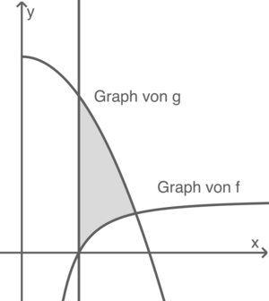

# Schwere Aufgaben

 - [Abi 2021 (WTR) Pflichtteil 2 Aufgabe 4 - Integral](https://www.schullv.de/mathe/pruefungswissen/baden_wuerttemberg/abi_2021/pflichtteil_2)
 - [Abi 2021 (WTR) Pflichtteil 2 Aufgabe 6.b - Vektor (machbar)](https://www.schullv.de/mathe/pruefungswissen/baden_wuerttemberg/abi_2021/pflichtteil_2)
 - [Abi 2021 (WTR) Wahlteil A1 Aufgabe A 1.3 - unnötig komplex formuliert](https://www.schullv.de/mathe/pruefungswissen/baden_wuerttemberg/abi_2021/wahlteil_a1)

# Rechenoperationen

## Potenzen

$$x^a \cdot x^b = x^{a+b}$$

$$a^n \cdot b^n = (a \cdot b)^n$$

Folgende Regel sollte man im Kontext substitution im Kopf haben.

$$\left(x^a\right)^b = x^{a\cdot b}$$

## Logarithmus

Mit dem Logarithmus *([Wikipedia](https://en.wikipedia.org/wiki/Logarithm))* kann man so etwas lösen:

$$a = b^x \qquad x = \log_b{a} \qquad \log_b{\left( b^x \right)} = x \quad b^{\log_b(x)} = x$$

### Produkte

Eine wichtige Eigenschaft des Logarithmuses ist es, dass wenn man zwei Logarithmusfunktionen mit der gleichen Basis $b$ addiert, so kann man diese in ein Logarithmus schreiben. Die Formel ist wie folgt:

$$\log_b(xy) = \log_bx + \log_b y$$

Dies bedingt auch das man Funktionen wie die folgende recht einfach lösen kann.

$$e^{2x} = 7e^x \quad | \ln$$
$$\ln{\left(e^{2x}\right)} = \ln{\left(7 \cdot e^x\right)}$$
$$2x = \ln{\left(7\right)} + \ln{\left(e^x\right)} =  \ln{\left(7\right)} + x \quad | -x$$
$$x = \ln7$$

### natürlicher Logarithmus

$$a = e^x \qquad x = \log_e{a} = \ln{a} \qquad \ln{\left( e^x \right)} = x \quad e^{\ln x} = x$$

$$e^{c \cdot \ln(x)} = x^c$$

$$\ln{1} = 0$$

# Ableitungen

Die Ableitung ist die Funktion, die die Änderung einer anderen Funktion beschreibt.

$f(x)$ | $f'(x)$
---|---
$x^n$ | $n \cdot x^{n-1}$
$3 \cdot x^4$ | $12 \cdot x^3$
$4x$ | $4$  
$ax^2 + bx + c$ | $2ax + b$  
$e^x$ | $e^x$
$n \cdot e^x$ | $n \cdot e^x$  
$e^{g(x)}$ | $g'(x) \cdot e^{g(x)}$
$\frac{u}{v}$ | $\frac{u' \cdot v - v' \cdot u}{v^2}$
$\frac{4}{x}$ | $- \frac{4}{x^2}$

$$f = \sin \quad f' = \cos \quad f'' = -\sin \quad f''' = -\cos \quad f'''' = \sin$$

Wichtig für sowohl Ableitungen, als auch Stammfunktionen ist das die Regel für Potenzen auch auf Wurzeln anwendbar ist, da: $\sqrt{x} = x^{\frac{1}{2}}$

## Summen regel

Sind Teile einer Funktion von $+$ oder $-$ getrennt, so wird jeder dieser Teile abgeleitet:

$$f(x) = u(x) + v(x)\qquad f'(x) = u'(x) + v'(x)$$

## Produktregel

Sind Teile einer Funktion von $\cdot$ abgetrennt, so wird die Produktregel angewandt:  

$$f(x) = u \cdot v\qquad f'(x) = u' \cdot v + u \cdot v' $$

## Kettenregel

$$f(x) = u(v(x)) \qquad f'(x) = u'(v(x)) \cdot v'(x)$$

### Beispiele

 - $f(x) = x^2 \cdot e^{-5x} \qquad f'(x) = 2x \cdot e^{-5x} + x^2 \cdot \left( -5e^{-5x} \right)$

## Hilfreiches Umstellen

$$\frac{c}{x^n} = c \cdot x^{-n}$$

# Kurvendiskussion

[Referenz](https://studyflix.de/mathematik/kurvendiskussion-aufgaben-3117)

## Definitionsbereich

## y-Achsenabschnitt

## x-Achsenabschnitt (Nullstellen)

Die Nullstellen sind die Punkte, an denen der Graph die x-Achse schneidet.

Der $x$ Wert ergibt sich, wenn man die Funktion mit $0$ gleichstellt, und nach $x$ auflößt:

$$f(x) = 0 \qquad P(x\;|\;0)$$

### Quadratische Funktion (ABC-Formel)

Hat man eine quatratische Funktion, lässt sich die Nullstelle mithilfe der ABC-Formel ermitteln:

$$f(x) = ax^2 + bx + c \qquad x_{1,2} = \frac{-b \pm \sqrt{b^2 - 4ac}}{2a}$$

### Ausklammern

Angenommen man hat folgende Gleichung:

$$a \cdot x^3 + b \cdot x = 0$$

Wichtig hierbei ist, das jeder *Teil* der Gleichung ein Faktor von $x$ ist, also z.B. nicht so: $3x^2 + x^3 + 1 = 0$  
Wenn man also eine Solche gleichung hat, kann man einfach Umstellen, und $x$ Ausklammern:

$$x \cdot (ax^2 + b) = 0$$

Da irgendetwas mit $0$ multipliziert **IMMER** auch $0$ ergibt, kann man die erste Lösung für $x$ ablesen: $x_1 = 0$. Für die zweite Lösung muss man das in der Klammer nach $0$ umstellen:

$$ax^2 + b = 0$$

So kann man die zweite Lößung $x_2$ herausfinden.

### Substititution

Dies werde ich anhand eines echten Beispiels zeigen:

$$y = 4x^4 - 9x^2 + 1 = 0$$

Da man hier weder Ausklammern, noch die [ABC-Formel](#quadratische-funktion-abc-formel) anwenden kann, muss man **Substituieren**. Das heißt man ersetzt ein Teil einer Funktion mir einer Variable. Hier ersetzten wie $x^2$ mit $u$:

$$u = x^2 \qquad y = 4u^2 - 9u + 1 = 0$$

Dadurch bekommt man eine Quadratische Funktion (in diesem Fall aber man kan das auch mit Funktionen machen die man dan anders lösen kann). Diese kann man dan mit der [ABC-Formel](#quadratische-funktion-abc-formel) lösen. Dies werde ich jetzt hier nicht zeigen.

$$u = \frac{9 \pm \sqrt{65}}{8} \qquad u_1 \approx 2,13 \qquad u_2 \approx0,12$$

Da $u = x^2$ muss man jetzt, um die Lösung für $x$ zu bekommen, die Wurzel von $u$ ziehen:

$$x_1 = \sqrt{u_1} \approx 1,46 \qquad x_2 = \sqrt{u_2} \approx 0,34$$

## Verhalten im Unendlichen

Hier betrachtet man Lediglich den Term mit dem höchsen Exponent:

$$\lim_{x \rightarrow -\infty} + x^2 = + \infty \qquad \lim_{x \rightarrow +\infty} + x^2 = + \infty$$
$$\lim_{x \rightarrow -\infty} - x^2 = - \infty \qquad \lim_{x \rightarrow +\infty} - x^2 = - \infty$$
$$\lim_{x \rightarrow -\infty} + x^3 = - \infty \qquad \lim_{x \rightarrow +\infty} + x^3 = + \infty$$
$$\lim_{x \rightarrow -\infty} - x^3 = + \infty \qquad \lim_{x \rightarrow +\infty} - x^2 = - \infty$$

## Symmetrie verhalten

## Extrempunkte

Extrempunkte sind alle Hoch/Tiefpunkte einer Funktion. Folgendes ist bei einem Extrempunkt gegeben:   
 - $f'(x) = 0$

Bedingung | Art d. Punktes
---|---
$f''(x) < 0$ | Hochpunkt
$f''(x) = 0$ | Sattelpunkt
$f''(x) > 0$ | Tiefpunkt

## Monotonieverhalten

## Wendepunkte

Bei einem Wendepunkt ändert sich die Richtung. Die Richtung kann man durch die erste Ableitung beschreiben. Diese geht vom positiven ins Negative oder anders herum. In beiden fällen impliziert das jedoch, das die Änderung der Richtung *(die zweite Ableitung)* Null sein muss.

$$f''(x) = 0\qquad W(x|f(x))$$

# Tangente Aufstellen

Man hat die Funktion $f(x)$ und will die Tangente an dem x-Wert $P_x$ finden.  
Eine Lineare Funktion hat folgende Form:
$$y = a \cdot x + c$$

## Steigung

Um die Steigung $a$ der Tangente zu berechnen, muss man die [Ableitung](#ableitungen) der Funktion $f$ berechnen. Dann setzt man $P_x$ ein:

$$a = f'(P_x)$$

## Verschiebdings

Als Erstes muss man den Punkt bekommen, durch den die Tangente durchgehen soll. Da man den x-Wert schon hat, ist dies einfach:

$$f(P_x) = P_x\qquad P (P_x|P_y)$$

Jetzt $c$ zu finden ist einfach. Man setzt ein und löst für $c$ auf.

$$P_y = a \cdot P_x + c$$
$$c = P_y - a \cdot P_x$$

# Stammfunktionen

Stammfunktionen sind essenziell für Integrale. Die beste Beschreibung wäre das Gegenteil einer **Ableitung**, eine "*Aufleitung*".

$f(x)$ | $F(x) + C$
-------|------------
$x^n$  | $\frac{1}{n + 1} \cdot x^{n + 1} = \frac{x^{n+1}}{n+1}$  
$x^4$ | $\frac{1}{5} \cdot x^5$  
$9 \cdot x^7$ | $\frac{9}{8} \cdot x^8$  
$n \cdot e^x$|$n \cdot e^x$
$e^{g(x)}$ | $\frac{1}{g'(x)} \cdot e^{g(x)} = \frac{e^{g(x)}}{g'(x)}$  
$e^{3x + 4}$ | $\frac{1}{3} e^{3x + 4} = \frac{e^{3x +4}}{3}$  
$10 \cdot e^{4x-8}$ | $\frac{20}{4} \cdot e^{4x-8}$  
$\frac{k}{x^n}$ | $\frac{-n \cdot k + k}{x^{n-1}}$  
$\frac{4}{x^2}$ | $- \frac{4}{x}$
$\sqrt{ax + c}$ | $\frac{2}{3 \cdot a} (ax + c)^{\frac{3}{2}}$

Für Sinus und Cosinus siehe [Ableitungen](#ableitungen).

## "Kettenregel"

Bei Stammfunktionen funktioniert die *Kettenregel* etwas anders als bei Ableitungen. Hierfür ziehe ich am besten ein real-Beispiel heran:

$$f(x) = \sqrt{4x - 7} = (4x - 7)^{\frac{1}{2}} \qquad u(x) = 4x - 7 \qquad u'(x) = 4$$
$$F(x) = \frac{\frac{2}{3} (4x - 7)^{\frac{3}{2}}}{4} = \frac{1}{6} (4x-7)^{\frac{3}{2}}$$

Generell kann man sagen:

$$f(x) = (u(x))^n \qquad F(x) = \frac{1}{(n+1) \cdot u'(x)} \cdot (u(x))^{n + 1}$$

**Wichtig:** Das funktioniert aber nur, wenn $u(x)$ linear ist, das heißt, wenn der größte Exponent $1$ ist.

# Integrale

Ein Integral berechnet den Flächeninhalt unter einer Funktion.  
Die größere Zahl steht bei einem Integral *meist* oben: $n > k$. 

## Funktion und x-Achse

$$\int_k^n g(x)\; dx = \Big[ G(x) \Big]_k^n = G(n) - G(k)$$
 
Die Form die ich hier angegeben habe gilt, wenn man den Flächeninhalt der Funktion $g(x)$ in dem Intervall $n - k$, und der X-Achse finden will. Die nötigen Schritte sind:

1. man berechnet die [Stammfunktion](#stammfunktionen) von $g(x)$
2. man setzt beide Zahlen des Abschnitts in diese ein und rechnet das Ergebnis der größeren Zahl minus dem Ergebniss der kleineren Zahl:  
   $G(n) - G(k)$

## Funktion und y-Achse

Will man das gleiche mit der y-Achse machen, so bildet man die Kehrfunktion, 
$$y = x + 1 \qquad x = y - 1$$  
und macht die gleichen Schritte mit dieser.

Visuell dreht man einfach die Funktion um.

## Funktion und eine andere Funktion

Möchte man den Flächeninhalt berechnen von 2 Funktionen in einem bestimmten Intervall, wie Beispielsweise die graue Fläche in dem obigen Bild so ist dies auch nicht viel schwerer. Man muss in dem Intervall die Funktion mit dem größeren Flächeninhalt minus die Funktion mit dem kleineren berechnen. Weiß man dies nicht, kann man auch den Betrag einer Funktion minus der anderen berechnen.

$$\int_k^n \left(g(x) - f(x)\right) dx = \Big[ G(x) - F(x) \Big]_k^n = (G(n) - F(n)) - (G(k) - F(k))$$

Hier ist es besonders sinnvoll zu vereinfachen wo man kann, sonst wird es sehr schnell zu komplex.
