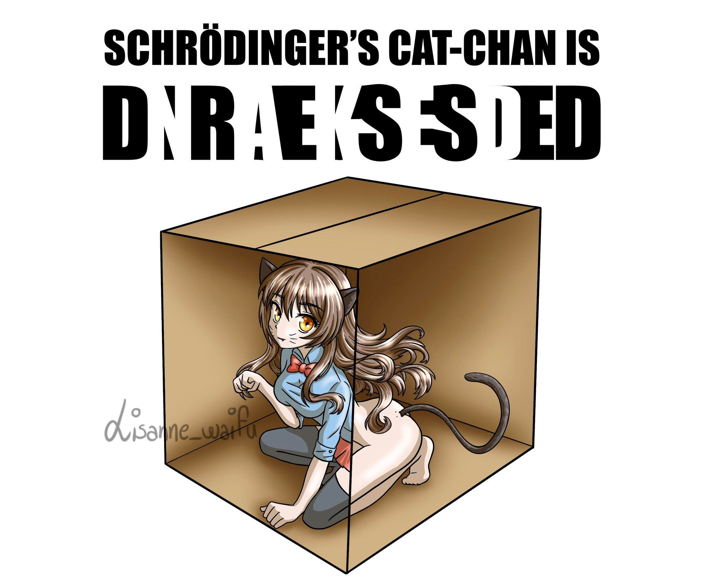
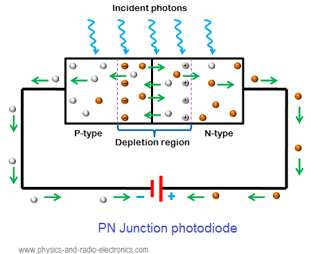

# Quantenphysik

1. Kupferplatte negativ aufgeladen und mit
   1. Licht einer lübirne
   2. Licht mehrere Glübirnen
   3. Licht einer Hg-Dampflampe
2. Selbe Versuche wie in 1, jedoch ist die Kupferplatte positiv geladen

## Beob:

1a + b: es passiert nichts
1c: Elektroskop entlädt sich
2a + b + c: es passiert nichts

## Erklärung zu 1c

Da sich das Elektroskop entlädt, müssen die überschüssigen Elektronen die Metalloberfläche verlassen haben. Dies ist nur möglich, wenn das auftreffende Licht mindestens so energiereich ist, dass es die Ablösenergie $W_A$ der Elektronen im Metall aufbringen kann.

# Max Planck: das Spektrum des Schwarzen Strahlens (1900)

Es konnte keine mathematische Formel hergeleitet werden, die das Spektrum exakt abbilden konnte. Es gab nur Teillösungen:

### Wiensche Verbindungsgesetz

Damit konnte das Maximum der intensität berechnet werden

### Rayligh-Jeans-Gesetz

konnte nur den Teil rechts vom Maximum exakt abbilden. Bei kleinen Wellenlängen kommt es zu sog. UV-Katastrophe

## Kopuskulartheorie des Lichtes

Licht besteht aus kleinen Teilchen, den sogenanten **Photonen**, die sich mit Lichtgeschwindigkeit im Raum ausbreiten.

## Theorie von Plank

Photonen haben keine kontinuirlich veränderbare Energie, sondern immer nur in diskreten Energiepaketen.

$$W_{Ph} = h \cdot f$$

Planksches Wirkungsquantum: $h = 6,626 \cdot 10^{-34} J \cdot s$

## Aufbau einer Photodiode

Das Licht, welches auf die Metalloberfläche trifft, gibt einem Teil seiner Energie in Form von Wärme ab und bei gespater Frequenz werden auch Photoektronen aus dem Metall gelöst, die sich zur Ringanode hinbewegen

$$h \cdot f = q \cdot U_{Ph} + W_A$$

### Folgerungen

1. Ist $W_{Ph} < W_A$, so kann das Licht keine Photoelektronen auslösen.
2. Ist $W_{Ph} > W_A$, so entstehen Photoeletronen mit unterschiedlicher Energie, im Spezialfall gilt: $W_{kin, max} = W_{Ph}-W_A$

z.B. Intensität von einer Lichtwelle ist proportional zum Amplitudenquadrat $\Rightarrow$ Energie einer Lichtquelle ist proportional zur Ammplitude

$$h \cdot f = W_{kin, e} + W_A$$

## Grenzfrequenz fgr

Unter Grenzfrequenz versteht man die minimale Frequenz, die das Licht haben muss, um den Photoeffekt auszulösen $\rightarrow$ $h \cdot f \ge W_A$ $\Rightarrow$ $f_{gr} \ge \frac{W_A}{h}$ $\rightarrow$ $\lambda_{max} = \frac{c \cdot h}{W_A}$

## Bestimmung von $h$ mit der Gegenfeldmethode

Die Gegenspannung $U_G$ wird so lange erhöht bis der photostrom $I_{Ph} = 0$ wird.  
$\Rightarrow$ selbst die schnellsten Photoelektronen können ie Ringanode nicht mehr erreichen.  
$\Rightarrow$ die abgelesene Gegenspannung $U_G$ entspricht der maximalen kinetischen Energie der ausgelösten Photoelektronen.

# Photodiode

$$h \cdot \frac{c}{\lambda} = q \cdot U_s$$

# Bestimmung von $h$ mithilfe eines Röntgenspektrums

Im Idealfall wird das beschleunigte Elektron in einem einzigen Prozeß auf $v=0\frac{m}{s}$ abgebremst und wandelt seine gesammte kinetische Energie in eine Röntgenspannung um.

$$
\lambda_{grenz} = \frac{h \cdot c}{q \cdot U_B}
\begin{cases}
   W_{kin} = \frac{1}{2} mv^2 = q \cdot U_B \\ W_{Phantom} = h \cdot f  = h \cdot \frac{c}{\lambda_{grenz}}
\end{cases}
$$

$h$: Planksches Wirkungsquantum  
$c$: Lichtgeschwindigkeit

# Misc

## Grenzfrequenz

Photoefekt $=$ maximale Frequenz des Lichts, bei der der Photoefekt ausgelöst wird

Röntgenstralen $=$ minimale Wellenlänge bei der es funktioniert.

# Der Compton - Effekt

beim Photoeffekt: Licht besteht aus kleinen Lichtquanten, den sog. Photonen, deren Energie gequantelt ist. Es gilt:

$$W_{Ph} = h \cdot f$$

$h:$ Planksches Wirkungsquantum  
$f:$ Frequenz

Wenn man Licht als Teilchen betrachtet, dann sollten diese Teilchen auch ein Impuls $p$ besitzen.

> Klassisch $p=m\cdot v \quad [p]=1N\cdot s$

**Problem**: Photonen bewegen sich mit Lichgeschwindigkeit und haben deshalb eine Ruhemasse von $m_0 = 0kg$

$$m = \frac{m_0}{\sqrt{1 - \frac{v^2}{c^2}}}$$

Lösung: Einstein: Energie-Masse-Äquivalenz $E = mc^2$

$$W_{Ph} = h \cdot f = \frac{h \cdot c}{\lambda} = m \cdot c^2 \Rightarrow m \cdot c = p = \frac{h}{\lambda}$$

## WICHTIG

$$P_{Ph} = \frac{h}{\lambda}$$

---

## Experiment

beide Sensoren sind in einer Koinzidenz Schaltung, dh. sie registrieren nur dann ein Ergebnis, wenn beide Sensoren gleichzeitig ausgelöst werden.

### Beobachtungen

1. Wenn das Elekton unter dem Winkel $\alpha = 0\degree $ registriert wird (frontaler Stoß), so ist keine Änderung der Wellenlänge festzustellen.
2. Wird das Elekron unter dem Winkel $\alpha$ registriert, so findet man unter dem Winkel $\beta$ ein Photon mit $\lambda' > \lambda$.
3. Die Änderung der Wellenlänge $\Delta \lambda = \lambda' - \lambda$ ist unabhängig von der Wellenlänge des einfalllenden Lichtquants.

### Erklärungen 

#### Zu 2

Beim Stoß gibt das Photon Energie and das Elektron ab. Daraus Folgt, die Energie des gestreuten Lichtquants ist kleiner als die des einfallenden, und wegen $W = h\cdot \frac{c}{\lambda}$.

### Formel

> Nach langem Rechnen

$$\Delta \lambda = \frac{h}{m_c \cdot c} \cdot (1 - \cos{\beta}) \qquad \lambda_c = \frac{h}{m_c \cdot c} = 2,4 pm$$

#### learn

$$\Delta \lambda = \lambda_c (1-\cos{\beta})$$

$\lambda_c$ = Compton-Wellenlänge = $2,4pm$

### Wichtig

Compton konnte mit seinem experiment das erste mal experimentell Nachweisen, das Licht auch Teilchencharakter besitzt.

Alle bisherigen Experimente konnten nur den Wellencharakter von Licht nachweißen.

Daraus folgt, je nachdem wie man das Experiment aufbaut, reagiert Licht entweder als Welle, oder als Teilchen. Man spricht deshalb auch vom Welle-Teilchen Dualismus.

# Ein Photonen Experimente

Ein Photon trifft auf Doppelspalt. Der Auftreffort des Photons auf dem Schirm wird duch Schwärzung einer Photoplatte registriert.

Man unterscheidet zwischen kurzen (wenige Minuten bis Stunden) und langer (mehrere Monate) Belichtungsdauer

Bei langer Belichtungsdauer ergibt sich aus dem Trefferbild der Photonen auf der Photoplatte ein Inteferenzmuster, dass dem eines klassischen Doppelspalt entspricht.

Bei kurzer Belichtungsdauer gibt es bei jeder messung ein neues Belichtungsbild, das nicht im zusammenhang steht.

## zu a:

Für das Photon sind beide Wege gleichberechtigt und es kann die _welcher Weg Frage_ . In diesem Fall steht nach langer Zeit das typische Inteferenzmuster eines Doppelspalts. 

Das heist es gibt Stellen auf der Photoplatte, auf denen kein Photon lokalisiert wird

## zu b 

Hier kann die _welcher Weg Frage_ beantwortet werden, daraus folgt, beide Wege sind für das Photon nicht mehr gleichberechtigt. Es kommt somit nicht zur Inteferenz des Doppelspalts, sondern es entsteht das Inteferenzmusters eines Einzelspalts.

## Übergang von der Klassischen Physik in die Quantenphysik

_klassische Physik_: Es gilt das Reflexions . und das Brechungsgesetz der Optik

_aber_ Es wird hier eine sehr große

Betrachtet man allerdings nur ein Photon, und stellt die Frage: geht das Photon durch das Plättchen, oder wird es reflektiert, so können wir darauf keine Antwort geben. Wir können aber mit hilfe der Statistik eine Warscheinlichkeitsaussage darüber machen, ob das photon reflektiert wird oder durch den  Crystall geht.

Ein weiteres Problem ergibt sich aus der newtonshen Mechanik: kennt man die Anfangsbedingungen der Bewegung eines Körpers, so kann man daraus seine Bewegungsbahn zu jedem späteren Zeitpunkt berrechnen.

Aber registrieren wir ein Photon mit einer bestimmten geschwindigkeit an einem bestimmten Ort des Kristalls, so kann man die Frage nach dem weiteren Verlaufs der Bahnkurve nicht beanteorten.

## Max Born

Verknüpfung von Wellen- und Teilchentheorie mit Hilfe der Wahrscheinlichkeitsrechnung (Statistik)

# Psi funktion

Die Schrödinger-Wellenfunktion, auch als Psi-Funktion ($\Psi$) bezeichnet, ist eine mathematische Funktion, die die Wahrscheinlichkeitsamplitude eines Quantenobjekts angibt. Sie beschreibt, wie sich ein Teilchen in einem bestimmten Zustand verhält und wie wahrscheinlich es ist, in einem bestimmten Zustand gefunden zu werden. Die Funktion hängt von den quantenmechanischen Eigenschaften des Teilchens ab und wird durch die Schrödinger-Gleichung beschrieben. Die Psi-Funktion ist komplexwertig und gibt uns Informationen über die Amplitude und Phase des Teilchens. Die Wahrscheinlichkeit, ein Teilchen in einem bestimmten Zustand zu finden, wird durch das Betragsquadrat der Psi-Funktion ($|\Psi^2|$) berechnet.

## Beispiel mit Doppelspalt

Ein Beispiel für die Anwendung der Schrödinger-Wellenfunktion auf die Interferenz von Licht wäre die Beschreibung des Doppelspalt-Experiments. Hier wird Licht durch einen Spalt in einer Barriere geschickt, wodurch sich eine Wellenfront ausbildet. Diese Wellenfront trifft dann auf einen Doppelspalt, der das Licht in zwei Teilstrahlen aufteilt, die dann auf einem Schirm dahinter interferieren.

Die Wahrscheinlichkeitsamplitude $\psi(x,y)$ des Lichts am Schirm kann als Überlagerung der Teilwellen, die durch die beiden Spalten entstehen, beschrieben werden:

$$\psi(x,y) = \psi_1(x,y) + \psi_2(x,y)$$

wobei $\psi_1(x,y)$ und $\psi_2(x,y)$ die Wellenfunktionen der beiden Teilstrahlen sind. Die Intensität des Lichts am Schirm, die durch das Betragsquadrat der Wahrscheinlichkeitsamplitude gegeben ist, zeigt Interferenzmuster, die charakteristisch für die Überlagerung der Teilwellen sind. Diese Interferenzmuster können je nach Phasenunterschied zwischen den Teilwellen konstruktiv oder destruktiv sein.

Das Doppelspalt-Experiment ist ein wichtiges Beispiel für die Anwendung der Schrödinger-Wellenfunktion auf die Interferenz von Licht, da es zeigt, dass Lichtwellen wie alle Teilchen und Wellen der Quantenwelt auch mit Welleneigenschaften beschrieben werden können.

# Kanaller - Test

 - Weg 1 zu $D_A$ hat insgesammt einen Phasensprung von $2\pi$  
 - Weg 2 zu $D_A$ hat insgesammt einen Phasensprung von $2\pi$  
 - Weg 1 zu $D_B$ hat insgesamt einem Phasensprung von $3\pi$
 - Weg 1 zu $D_B$ hat insgesamt einem Phasensprung von $\pi$

## Fall 1: Beide Kugeln sind nicht präperiert

 - für das Photon sind beide Wege gleichberechtigt.
 - es kommt zur konstruktiver Interferenz
 - $D_A$ macht Klick

## Fall 2: Kugel 2 ist präperiert, Kugel 1 nicht

 - beide Wege sind nicht mehr gleichberechtigt
 - Interferenz der Wege entfällt.
   - Photon passiert ST1 
     - zu $50\%$ geradeaus _(präperierte Kugel wird zerstört)_
     - zu $50\%$ nach oben.
   - Photon passiert ST2
     - zu $50%$ geradeaus _(die präperierte Kugel wird fälschlicherweise als normale Kugel erkannt)_
     - zu $50\%$ nach oben _($D_B$ macht Klick)_
 - insgesamt können $25\%$ der präperierten Kugeln gerettet werden, ohne dass sie je mit einem Photon in Berührung kamen.

## das Komplimentaritätsprinzip

Quantenobjekte besitzen sowohl Wellen, als auch Teilchencharakter. Kann bei mehreren zu verfügung stehenden Wegen die _welcher Weg_ frage beantwortet werden, so verhält sich der Quant wie ein Teilchen. Kann diese Frage nicht beantwortet werden, so verhält sich der Quant wie eine Welle.

## Louis de Broglie (1923)

**Bis dahin bekannt**: Photonen haben Wellencharakter (Interferenz, Beugung) und Teilchencharakter.

**seine Idee**: Diese Eigenschaften sollten allen Quanten zu eigen sein, z.B. auch Elektronen.  
*bisher*: Elektronen als klassisches Teilchen (ablenkung im E bzw B-Feld)  
*neu*: Elektronen sollten auch Wellencharakter besitzten mit einer Wellenlänge.

$$\lambda(U_B) = \frac{h}{\sqrt{2qm}} \cdot \frac{1}{\sqrt{U_B}} = 1,23\cdot 10^{-9}mv^{\frac{1}{2}} \cdot \frac{1}{\sqrt{U_B}}$$
