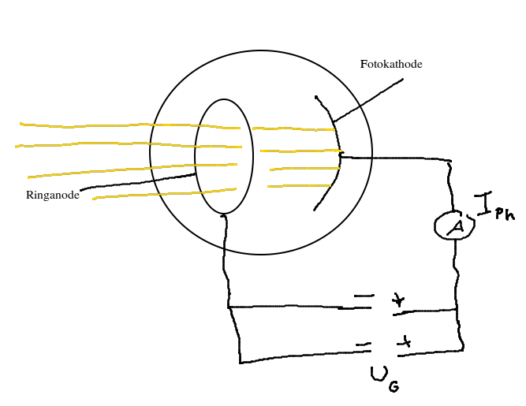

# Photoeffekt

*S.235* [video](https://youtu.be/rzEoA-MDpIs)

Licht strahlt auf die Fotokathode und lößst Elektronen.

- intensiver/helleres Licht => mehr Elektronen
- höhere Frequenz des Lichtes => schnellere Elektronen *höhere kinetische Energie*

Es gibt eine **Mindestfrequenz/Grenzfrequenz $f_{grenz}$**, die mindestens benötigt wird, um Elektronen auszullösen. Dies ist bei jedem Metall anders und wird mit der **Austrittsenergie** $W_A$ beschrieben.

$$E_{ph} = h \cdot f$$

## Formeln

$$E_{kin} = h \cdot f - W_A$$

- $h$ Planksche's Wirkungsquantum

$$f = \frac{c}{\lambda}$$

- $c$ Lichtgeschwindigkeit

$$f_{grenz} = \frac{E_{kin}}{h}$$

$$E_{kin} = \frac{1}{2} mv^2$$

$$E_{ges} = E_{kin} + W_{A} = h \cdot f$$

# Elektronenbeugung

$$p = \frac{h}{\lambda}$$

Materie ist auch eine Welle

## Bedingung

Das eine Beugung stattfindet, muss die Spaltbreite ungefähr im Bereich der Wellenlänge, oder darunter liegen.
