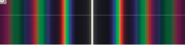
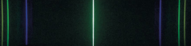

# Inhalt

- [Inhalt](#inhalt)
- [Wellen](#wellen)
  - [Terminologie](#terminologie)
    - [Oszillator](#oszillator)
  - [Formelzeichen](#formelzeichen)
    - [Ausbreitungsgeschwindigkeit](#ausbreitungsgeschwindigkeit)
    - [Wellenlänge](#wellenlänge)
    - [Erreger-Frequenz](#erreger-frequenz)
    - [Schnelle](#schnelle)
  - [Formeln](#formeln)
  - [Inteferenz](#inteferenz)
    - [Gangunterschied](#gangunterschied)
    - [Konstruktive Interferenz](#konstruktive-interferenz)
    - [Destruktive Inteferenz](#destruktive-inteferenz)
  - [Diagramme zeichnen](#diagramme-zeichnen)
    - [$t$ - $s\_y$ - Diagramm an Ort $x\_0$](#t---s_y---diagramm-an-ort-x_0)
- [Wellenoptik](#wellenoptik)
  - [Gitter](#gitter)
  - [Interferenz am Doppel-, Deifach-, Vierfach- bzw n-fach Spalt](#interferenz-am-doppel--deifach--vierfach--bzw-n-fach-spalt)
    - [Merke](#merke)
  - [Das Spektrum des weißen Lichtes](#das-spektrum-des-weißen-lichtes)
    - [Merke](#merke-1)
  - [Gitter bei kontinuierlichem Spektrum](#gitter-bei-kontinuierlichem-spektrum)
    - [Erklärung](#erklärung)
  - [Das Spektrum einer Hg-Dampf-Lampe](#das-spektrum-einer-hg-dampf-lampe)

# Wellen

## Terminologie

### Oszillator

Viele Wellen bestehen aus Oszillatoren die Schwingen, und dann andere anstoßen und zum Schwingen bringt. Ein Oszillator ist also ein Schwingendes Teilchen.

## Formelzeichen

### Ausbreitungsgeschwindigkeit

$$c = \left[1\frac{m}{s}\right]$$

### Wellenlänge

$$\lambda = \left[1m\right]$$

Die Wellenlänge ist der x-Abstand eines Teilchens zum nächsten Teilchen im gleichen Schwingungszustand. Es ist vergleichbar mit der Schwingungsdauer $T$ einer Schwingung.

### Erreger-Frequenz

$$f = \left[1 Hz = 1s^{-1}\right]$$

Die Erregerfrequenz sagt aus mit Welcher Frequenz die Oszillatoren Schwingen. Folglich gibt es auch ein Erregerwellenlänge.

### Schnelle

$$v = \left[\frac{m}{s}\right]$$

Die Schnelle beschreibt lediglich die Geschwindigkeit der Oszillatoren

Querwelle/Transversalwelle | Längswelle/Longitudinalwelle
---|---
$v$ und $c$ sind senkrecht | $v$ und $c$ sind parallel

## Formeln

Die [Wellenlänge](#wellenlänge), [Erreger-Frequenz](#erreger-frequenz) und [Ausbreitungsgeschwindigkeit](#ausbreitungsgeschwindigkeit) sind abhängig voneinander:

$$c = \lambda \cdot f \qquad \lambda = \frac{c}{f} \qquad f = \frac{c}{\lambda}$$

## Inteferenz

Bei der Inteferenz zweier Wellen schauen wir uns haupsächlich die Inteferenz zweier Wellen mit gleicher Frequenz an.

### Gangunterschied

Die Verschiebung *auf der x-Achse* zweier Wellen nennt man Phasenunterschied.

Eine **Phase** ist einmal hin und her Schwingen, und entspricht $\phi = 2\pi$

Der **Gangunterschied** bzw. Phasesnunterschied beschreibt die Strecke, um die die zweite Welle von der ersten Verschoben ist. Das heißt man mus sowohl die Phase, als auch die Wellenlänge mit einberechnen

$$\delta = \lambda \cdot \frac{\Delta \phi}{2\pi}$$

### Konstruktive Interferenz

Da man die Resultierende Welle bei einer Überlagerung von zweien durch einfache Addition beider Funktionen errechnet, addieren sich einfach die Amplituden der beiden Wellen, wenn der [Gangunterschied](#gangunterschied) $\delta$ ein ganzzahliges Vielfaches der [Wellenlänge](#wellenlänge) $\lambda$ ist.

$$\delta = k \cdot \lambda \qquad k \in \mathbb{N}$$

### Destruktive Inteferenz

Genauso subtrahieren sich beide Amplituden der Wellen, bei einer Phasendifferenz halb so groß wie die Wellenlänge.

$$\delta = (2k - 1) \cdot \frac{1}{2} \lambda \qquad k \in \mathbb{N}$$

## Diagramme zeichnen

### $t$ - $s_y$ - Diagramm an Ort $x_0$

1. Berechne die Zeit $t$, welche die Störung auf dem Wellenträger benötigt, um den Ort $x_0$ zu erreichen: $c = \frac{s_x}{t} \qquad t = \frac{s_x}{c}$
2. an diesem Ort beginnt der Oszillator die Schwingung auszuführen, welche am Ort $x=0$ begonnen hat. **Achtung**: Anfangsbedingung beachten *(Auslenkung nach oben oder unten)*
3. benötigt wird jetzt zusätzlich die Schwingungsdauer $T$ oder die Frequenz $f$ und die Amplitude $\hat{s_y}$.

# Wellenoptik

## Gitter

> Ein Gitter ist ein Mehrfachspalt mit bestenfalls unendlich Spalten. $n = \infin$

Die Gitterkonstante $g = [1m]$ beschreibt den Abstand zwischen den Spalten des Gitters. 

Das $k$'te Maxima bei einem Gitter gilt:  
$$\sin{\alpha_k} = k \cdot \frac{\lambda}{g}$$
wobei $\alpha_k$ den Winkel zwischen Spalt und Maximalstelle beschreibt.

Den Gleichen Winkel kann man auch mit folgender Formel berrechnen:
$$\tan{\alpha_k} = \frac{d_k}{a}$$

Wert | Beschreibung
---|---
$d_k = [1m]$ | der Abstand des $k$'ten Maxima und des Hauptmaxima
$a = [1m]$ | der Abstand des Gitters und dem Schirm

## Interferenz am Doppel-, Deifach-, Vierfach- bzw n-fach Spalt

o | Doppelspalt | Dreifachspalt | Vierfachspalt
---|---|---|---
Maximum 0. Ordnung | $\delta = 0$ | $\delta = 0$ | $\delta = 0$
Nullstelle 1 | $\delta = \frac{\lambda}{2}$ | $\delta = \frac{\lambda}{3}$ | $\delta = \frac{\lambda}{4}$
Maximum 1. Ordnung | $\delta = \lambda$ | $\delta = \frac{\lambda}{2}$ | $\delta = \lambda$
Nullstelle 2 | | $\delta = \frac{2}{3} \lambda$ | $\delta = \frac{\lambda}{2}$
Maximum 2. Ordnung | | $\delta = \lambda$
Nullstelle 3 | | | $\delta = \frac{3}{4}\lambda$
generell| zwischen 2 Maxima eine Nullstelle und kein Nebenmaximum | zwischen 2 Maxima zwei Nullstellen und ein Nebenmaximum | zwischen 2 Maxima 3 Nullstellen und 2 Nebenmaxima.

### Merke

Zwischen zwei benachbarten Maxima eines $n$ fach Spaltens, liegen immer $n-1$ Nullstellen und $n-2$ Nebenmaxima. Je größer $n$ wird, desto
 - schärfer ausgeprägt sind die Maxima.
 - Schwächer *(vor allem in der Intensität)* sind die Nebenmaxima.

## Das Spektrum des weißen Lichtes

Farbe | Wellenlänge
--- | ---
violett | $400nm \le \lambda \le 420nm$
blau | $420nm \le \lambda \le 500nm$
grün | $500nm \le \lambda \le 580nm$
gelb | $580nm \le \lambda \le 600nm$
rot | $600nm \le \lambda \le 800nms$

### Merke

Licht unterschiedlicher Wellenlänge wird in einem Prisma unterschiedlich stark gebrochen. Dieses Phänomen nennt man **Dispersion**.

Dabei wird das Licht umso stärker gebrochen, je kleiner seine Wellenlänge ist.

Das Spektrum des weißen Lichtes ist ein kontinuierliches Spektrum mit fliesenden Übergänge.

## Gitter bei kontinuierlichem Spektrum

Fällt weißes Licht auf ein Gitter so ist bei dem Hauptmaximum ein weißer Fleck zu sehen, rechts und links vom Hauptmaximum wird das Licht in seine Spektralfarben zerlegt (immer von innen Violett bis nach außen Rot).

Mit höherer Ordnung wird die breite der Maxima größer und es kommt auch zur Überlappung verschiedener Maxima.

### Erklärung

Beim Hauptmaximum treffen alle Wellenlängen des Lichtes wieder aufeinander, und es entsteht der Gesamteindruck weiß.

Wegen 
$\sin{\alpha_k} = k \cdot \frac{\lambda}{g}$
gilt:

$$\sin{\alpha_k} \sim \lambda$$

## Das Spektrum einer Hg-Dampf-Lampe

Betrachtet man das Licht einer Quecksilberdampflampe durch ein Gitter, so stellt man fest dass es sich hier nicht um ein kontinuirlichtes Spektrum handelt, sondern um ein sogenanntes Linienspektrum. Im Falle von Quecksilber sind nur die Linien Violet, Grün und Orange zu sehen. Man nennt es deshalb auch *charakteristisches Spektrum*.
