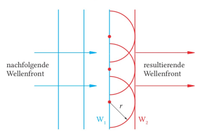

# Gitter

> Ein Gitter ist ein Mehrfachspalt mit bestenfalls unendlich Spalten. $n = \infty$

Die Gitterkonstante $g = [1m]$ beschreibt den Abstand zwischen den Spalten des Gitters. 

Das $k$'te Maxima bei einem Gitter gilt:  
$$\sin{\alpha_k} = k \cdot \frac{\lambda}{g}$$
wobei $\alpha_k$ den Winkel zwischen Spalt und Maximalstelle beschreibt.

Den Gleichen Winkel kann man auch mit folgender Formel berrechnen:
$$\tan{\alpha_k} = \frac{d_k}{a}$$

Bei einem Mehrfachspalt gilt folgende Formel für Maxiam. Bei einem Einzelspalt gilt diese für Nullstellen:
$$\sin{\alpha_k} = k \cdot \frac{\lambda}{b}$$

wobei $b$ die Breite des Spaltes ist.

Wenn $\alpha \le 5°$, dann gilt :

$$\sin{\alpha} \approx \tan{\alpha}$$

Wert | Beschreibung
---|---
$d_k = [1m]$ | der Abstand des $k$'ten Maxima und des Hauptmaxima
$a = [1m]$ | der Abstand des Gitters und dem Schirm

# Interferenz am Doppel-, Deifach-, Vierfach- bzw n-fach Spalt

o | Doppelspalt | Dreifachspalt | Vierfachspalt
---|---|---|---
Maximum 0. Ordnung | $\delta = 0$ | $\delta = 0$ | $\delta = 0$
Nullstelle 1 | $\delta = \frac{\lambda}{2}$ | $\delta = \frac{\lambda}{3}$ | $\delta = \frac{\lambda}{4}$
Maximum 1. Ordnung | $\delta = \lambda$ | $\delta = \frac{\lambda}{2}$ | $\delta = \lambda$
Nullstelle 2 | | $\delta = \frac{2}{3} \lambda$ | $\delta = \frac{\lambda}{2}$
Maximum 2. Ordnung | | $\delta = \lambda$
Nullstelle 3 | | | $\delta = \frac{3}{4}\lambda$
generell| zwischen 2 Maxima eine Nullstelle und kein Nebenmaximum | zwischen 2 Maxima zwei Nullstellen und ein Nebenmaximum | zwischen 2 Maxima 3 Nullstellen und 2 Nebenmaxima.

## Merke

Zwischen zwei benachbarten Maxima eines $n$ fach Spaltens, liegen immer $n-1$ Nullstellen und $n-2$ Nebenmaxima. Je größer $n$ wird, desto
 - schärfer ausgeprägt sind die Maxima.
 - Schwächer *(vor allem in der Intensität)* sind die Nebenmaxima.

# Das Spektrum des weißen Lichtes

Farbe | Wellenlänge
--- | ---
violett | $400nm \le \lambda \le 420nm$
blau | $420nm \le \lambda \le 500nm$
grün | $500nm \le \lambda \le 580nm$
gelb | $580nm \le \lambda \le 600nm$
rot | $600nm \le \lambda \le 800nms$

## Merke

Licht unterschiedlicher Wellenlänge wird in einem Prisma unterschiedlich stark gebrochen. Dieses Phänomen nennt man **Dispersion**.

Dabei wird das Licht umso stärker gebrochen, je kleiner seine Wellenlänge ist.

Das Spektrum des weißen Lichtes ist ein kontinuierliches Spektrum mit fliesenden Übergänge.

# Gitter bei kontinuierlichem Spektrum

Fällt weißes Licht auf ein Gitter so ist bei dem Hauptmaximum ein weißer Fleck zu sehen, rechts und links vom Hauptmaximum wird das Licht in seine Spektralfarben zerlegt (immer von innen Violett bis nach außen Rot).

Mit höherer Ordnung wird die breite der Maxima größer und es kommt auch zur Überlappung verschiedener Maxima.

## Erklärung

Beim Hauptmaximum treffen alle Wellenlängen des Lichtes wieder aufeinander, und es entsteht der Gesamteindruck weiß.

Wegen 
$\sin{\alpha_k} = k \cdot \frac{\lambda}{g}$
gilt:

$$\sin{\alpha_k} \sim \lambda$$

# Das Spektrum einer Hg-Dampf-Lampe

Betrachtet man das Licht einer Quecksilberdampflampe durch ein Gitter, so stellt man fest dass es sich hier nicht um ein kontinuirlichtes Spektrum handelt, sondern um ein sogenanntes Linienspektrum. Im Falle von Quecksilber sind nur die Linien Violet, Grün und Orange zu sehen. Man nennt es deshalb auch *charakteristisches Spektrum*.

# Die Brechung von Licht in optischen Medien

$$n = \frac{c_1}{c_2}$$

$n =$ Brechungszahl

## Gesetz von Smellius

Es gilt: 
$$c_{medium} = \frac{c_0}{n} \qquad \lambda = \frac{\lambda_0}{n}$$

